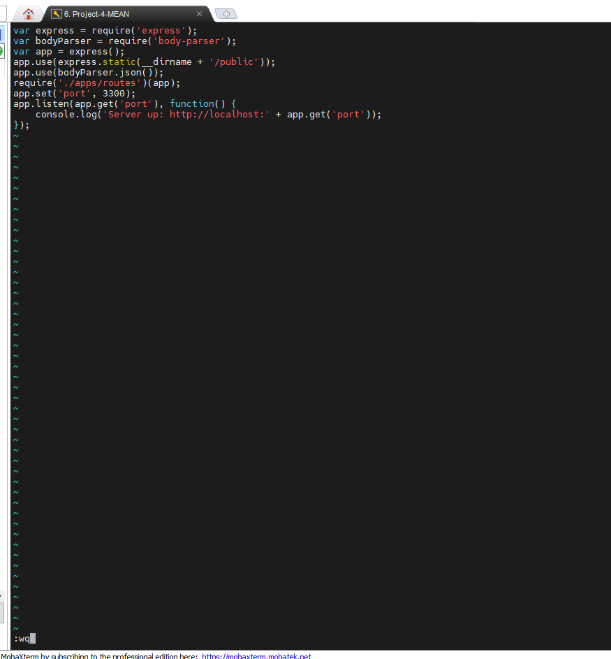

# MEAN STACK DEPLOYMENT TO UBUNTU IN AWS #

## Step 1: Install NodeJs ##

## Step 2: Install MongoDB ##

## Install npm ##

## Step 3: Install Express and set up routes to the server ##

## Step 4 – Access the routes with AngularJS ##

